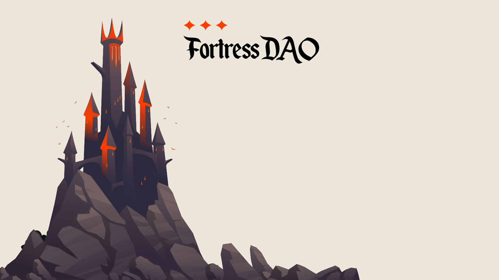

# Introduction

IntroductionWelcome to Fortress DAO.Fortress DAO is a decentralized reserve currency on the Avalanche network, with technology forked from Olympus DAO. Fortress will utilise the familiar bond-and-stake (mint) methodology〖🏰 ,🏰〗, in order to raise capital and grow token supply. On top of this, Fortress DAO invests funds from the treasury into various strategies, providing a higher backing for $FORT.DeFi is experiencing colossal growth. Improved market efficiency, a strong track record, and poor yield in traditional investment vehicles are pushing both retail and institutional investors into the sector. Even now, the global financial market remains largely unpenetrated, creating the potential **for you** to build generational wealth.Cryptocurrency democratises investment opportunity - meaning if you have capital, you can invest. Transactions are decentralised, rapid and secure. Contracts are verifiable, and are the law.However, like any emerging market, there is significant information asymmetry. As usual, those with large amounts of capital or those with power are able to capture this and maximise their return.At Fortress DAO, we want to level the playing field. By using the communities connections and the treasuries capital - we can generate alpha and maximise return. This return will in turn grow the treasury and wealth for FORT holders.
